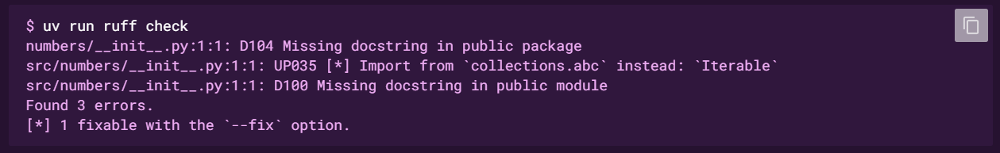
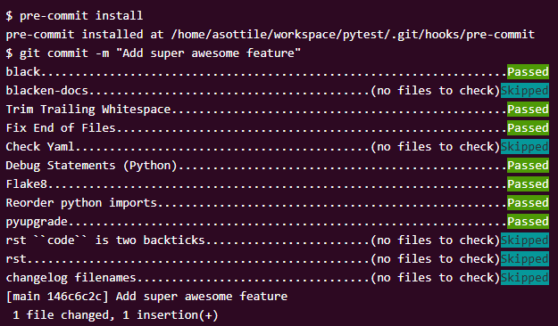

# Setup

### Install [uv](https://github.com/astral-sh/uv)

> [!NOTE]
> uv - fast Python package installer and resolver

To install uv run:

Using standalone installers
```bash
# On macOS and Linux.
curl -LsSf https://astral.sh/uv/install.sh | sh

# On Windows.
powershell -ExecutionPolicy ByPass -c "irm https://astral.sh/uv/install.ps1 | iex"
```

Using PyPI
```bash
# With pip.
pip install uv
```

### Initialize project

```bash
# Init project for library development
uv init --lib simple_library

# Or simple project init
uv init simple_project
```

This command creates a Python project with the following structure:
```bash
# If inited as library
simple_library
  ├── README.md
  ├── .python-version
  ├── pyproject.toml
  └── src
      └── simple_library
          ├── __init__.py
          └── py.typed

# If inited as project
simple_project
  ├── README.md
  ├── .python-version
  ├── pyproject.toml
  └── main.py
```

### Add Ruff to the project
Enter the project directory (it contains `pyproject.toml` config file): `cd simple_project`

Add Ruff to the project (use --dev flag cause it's not a project dependency): `uv add --dev ruff`

It creates new elements of the project and updates `pyproject.toml`:
```bash
simple_project
  ├── ...
  ├── .venv
      └── ...
  └── uv.lock
```

uv's lockfile is a snapshot of the project's fully-resolved dependencies at a moment in time, and ensures that the project's environment is consistent across machines.

Critically, the lockfile is cross-platform, in that it can be used to install a given project on any platform, regardless of where it was generated. uv defines a unique solution for every platform, producing a readable and auditable lockfile that defines exactly which packages will be installed.

For example: if you run uv lock on macOS, uv still generates resolutions for Linux and Windows, even if the set of required dependencies is slightly different on each platform.
<hr>

### Run

Run the project or command with:
```bash
# Run command
uv run <command>

# Run project
uv run <script>.py

# Run command example
PS C:\Users\selvnv\Desktop\py-setup\simple_project> uv run ruff check
main.py:3:8: F401 [*] `os` imported but unused
  |
1 | from typing import Iterable
2 |
3 | import os
  |        ^^ F401
  |
  = help: Remove unused import: `os`

Found 1 error.
[*] 1 fixable with the `--fix` option.

# Run project example
PS C:\Users\selvnv\Desktop\py-setup\simple_project> uv run .\main.py
 * Serving Flask app 'main'
 * Debug mode: on
WARNING: This is a development server. Do not use it in a production deployment. Use a production WSGI server instead.
 * Running on http://127.0.0.1:5000
Press CTRL+C to quit
 * Restarting with stat
 * Debugger is active!
```

The center point of the project API is `uv run`, which runs a command in the project's environment (without requiring explicit activation of a virtual environment).

uv run is fast enough that every invocation will implicitly re-lock and re-sync the project, ensuring that your environment is up-to-date without the need for manual intervention.

In other words, uv run guarantees that your command is executed in a consistent, locked environment.

### Ruff

#### Run
```bash
# Run linter
uv run ruff check

# Check and try to fix automatically
uv run ruff check --fix

# Run formatter
uv run ruff format
```
<hr>

#### [Config](https://docs.astral.sh/ruff/settings/)
To determine the appropriate settings for each Python file, Ruff looks for the first pyproject.toml, ruff.toml, or .ruff.toml file in the file's directory or any parent directory.

Config examples:
```toml
# Use pyproject.toml
[tool.ruff]
# Set the maximum line length to 79.
line-length = 79

[tool.ruff.lint]
# Add the `line-too-long` rule to the enforced rule set. By default, Ruff omits rules that
# overlap with the use of a formatter, like Black, but we can override this behavior by
# explicitly adding the rule.
extend-select = ["E501"]
```

```toml
# Or ruff.toml
# Set the maximum line length to 79.
line-length = 79

[lint]
# Add the `line-too-long` rule to the enforced rule set. By default, Ruff omits rules that
# overlap with the use of a formatter, like Black, but we can override this behavior by
# explicitly adding the rule.
extend-select = ["E501"]
```
<hr>

#### [Rules](https://docs.astral.sh/ruff/rules/)

Ruff supports over 800 lint rules split across over 50 built-in plugins, but determining the right set of rules will depend on your project's needs: some rules may be too strict, some are framework-specific, and so on.

By default, Ruff enables Flake8's F rules, along with a subset of the E rules, omitting any stylistic rules that overlap with the use of a formatter, like ruff format or Black.

If you're introducing a linter for the first time, the default rule set is a great place to start: it's narrow and focused while catching a wide variety of common errors (like unused imports) with zero configuration.

For example, if we want to enforce the pyupgrade rules, we can set our configuration file to the following:
```toml
[project]
requires-python = ">=3.10"

[tool.ruff.lint]
extend-select = [
  "UP",  # pyupgrade
]
```

Over time, we may choose to enforce additional rules. For example, we may want to enforce that all functions have docstrings:

```toml
[project]
requires-python = ">=3.10"

[tool.ruff.lint]
extend-select = [
  "UP",  # pyupgrade
  "D",   # pydocstyle
]

[tool.ruff.lint.pydocstyle]
convention = "google"
```

If we run Ruff again, we'll see that it now enforces the pydocstyle rules:

```bash
uv run ruff check
```


#### Ignoring errors

Any lint rule can be ignored by adding a `# noqa` comment to the line in question. For example, let's ignore the `UP035` rule for the Iterable import:

```python
from typing import Iterable  # noqa: UP035


def sum_even_numbers(numbers: Iterable[int]) -> int:
    """Given an iterable of integers, return the sum of all even numbers in the iterable."""
    return sum(num for num in numbers if num % 2 == 0)
```

Running `ruff check` again, we'll see that it no longer flags the `Iterable` import

If we want to ignore a rule for an entire file, we can add the line `# ruff: noqa: {code}` anywhere in the file, preferably towards the top, like so:

```python
# ruff: noqa: UP035
from typing import Iterable


def sum_even_numbers(numbers: Iterable[int]) -> int:
    """Given an iterable of integers, return the sum of all even numbers in the iterable."""
    return sum(num for num in numbers if num % 2 == 0)
```

### [Pre-Commit](https://pre-commit.com/) integration

> [!NOTE]
> Like many other Version Control Systems, Git has a way to fire off custom scripts when certain important actions occur. There are two groups of these hooks: client-side and server-side. Client-side hooks are triggered by operations such as committing and merging, while server-side hooks run on network operations such as receiving pushed commits. You can use these hooks for all sorts of reasons.

The [pre-commit hook](https://git-scm.com/book/en/v2/Customizing-Git-Git-Hooks) is run first, before you even type in a commit message. It’s used to inspect the snapshot that’s about to be committed, to see if you’ve forgotten something, to make sure tests run, or to examine whatever you need to inspect in the code. Exiting non-zero from this hook aborts the commit, although you can bypass it with git commit --no-verify. You can do things like check for code style (run lint or something equivalent), check for trailing whitespace (the default hook does exactly this), or check for appropriate documentation on new methods.

* Install Pre-Commit: Run command: `uv add --dev pre-commit`
* Add a Pre-Commit configuration:
  * Create a file named `.pre-commit-config.yaml`
  * Fill the config-file.
* Run `uv run pre-commit install` to install pre-commit into your git hooks
  * pre-commit will now run on every commit
  * The first time pre-commit runs on a file it will automatically download, install, and run the hook. Note that running a hook for the first time may be slow. For example: If the machine does not have node installed, pre-commit will download and build a copy of node.



####
Pre-Commit config file example:

```yaml
- repo: https://github.com/astral-sh/ruff-pre-commit
  # Ruff version.
  rev: v0.9.7
  hooks:
    # Run the linter.
    - id: ruff
    # Run the formatter.
    - id: ruff-format
```

<hr>

#### Some config elements description

##### .pre-commit-config.yaml - top level
| Element name| Descrition |
| --- | --- |
| repos | A list of repository mapping (check `.pre-commit-config.yaml - repos` section) |
| exclude | (optional: default ^$) global file exclude pattern. |
| fail_fast | (optional: default false) set to true to have pre-commit stop running hooks after the first failure. |

A sample top-level:

```yaml
exclude: '^$'
fail_fast: false
repos:
-   ...
```

##### .pre-commit-config.yaml - repos

| Element name| Descrition |
| --- | --- |
| repo | the repository url to git clone |
| rev | the revision or tag to clone at |
| hooks | A list of hook mappings (check `.pre-commit-config.yaml - hooks` section) |

A sample repository:

```yaml
repos:
-   repo: https://github.com/pre-commit/pre-commit-hooks
    rev: v1.2.3
    hooks:
    -   ...
```

##### .pre-commit-config.yaml - hooks

| Element name| Descrition |
| --- | --- |
| id | which hook from the repository to use |
| alias | (optional) allows the hook to be referenced using an additional id when using `pre-commit run <hookid>` |
| name | (optional) override the name of the hook - shown during hook execution |
| args | (optional) list of additional parameters to pass to the hook. |
| always_run | (optional) if true, this hook will run even if there are no matching files |
| verbose | (optional) if true, forces the output of the hook to be printed even when the hook passes |
| log_file | (optional) if present, the hook output will additionally be written to a file when the hook fails or verbose is true |

One example of a complete configuration:

```yaml
repos:
-   repo: https://github.com/pre-commit/pre-commit-hooks
    rev: v1.2.3
    hooks:
    -   id: trailing-whitespace
```
